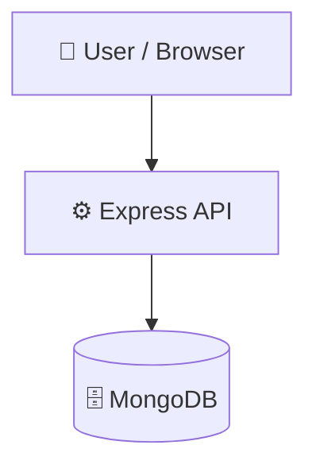

# Backend-Practice

> A collection of practice backend and full-stack web applications.

      

---

## 📝 Description

Backend-Practice is a multi-project monorepo workspace featuring various backend APIs and full-stack web applications built using Express.js, MongoDB, and React. It serves as a practical implementation playground, demonstrating how to build, scale, and structure different application types ranging from simple notes APIs to complete e-commerce and social media clones.

---

## ✨ Key Features

- **🛒 E-Commerce Routing and Auth** — Features dedicated Express.js routes for product browsing, review creation, and user authentication.
- **🗄️ Mongoose Database Modeling** — Utilizes Mongoose schemas for structured data models alongside automated database seeding capabilities.
- **🎨 EJS Templating and Layouts** — Renders dynamic HTML using EJS views and `ejs-mate` for modular layout management.
- **⚛️ React Frontend Codebases** — Integrates client-side React rendering using Vite and React Router within the `Insta-App` directory.
- **📂 Multi-Project Organization** — Separates distinct application contexts including student management, Spotify integrations, notes APIs, and e-commerce.

---

## 🎯 Use Cases

- **Server-Side Rendered Web Apps:** Exploring practical implementations of Node.js and MongoDB web applications using templating.
- **Database Schema Design:** Understanding Mongoose models, data relationships, and seeding database mock data.
- **Middleware & Security:** Studying routing, request validation, and cookie/session-based or JWT-based authentication.
- **Modern Routing Architectures:** Comparing client-side React routing architectures against traditional server-side EJS templating models.

---

## 🛠️ Tech Stack

   

**Notable core libraries:** `mongoose`, `ejs`, `ejs-mate`, `express`, `bcrypt`, `jsonwebtoken`, `cookie-parser`.

---

## 🏗️ Architecture

A high-level view of how the client, backend APIs, and databases interact across these workspace applications:




## ⚡ Quick Start

```bash
# 1. Clone the repository
git clone https://github.com/ayush-68789/Backend-Practice.git

# 2. Install dependencies
npm install

# 3. Start the dev server
npm run start
```

---

## ⚙️ Configuration

TODO: If your sub-projects require specific environment variables (like MongoDB connection strings or JWT secrets), document them here. For example: 
Create a .env file in the root of the individual sub-projects (e.g., inside Spotify-Project or Notes-Api_MongoDB/Backend):

PORT=5000
MONGODB_URI=mongodb://127.0.0.1:27017/your_db_name
JWT_SECRET=your_fallback_secret_key

---

## 📦 Key Dependencies

The primary packages used across the projects are listed below:

| Package | Version | Description |
| :--- | :--- | :--- |
| `express` | `^5.2.1` | Minimalist web framework for Node.js |
| `mongoose` | `^9.6.3` | MongoDB object modeling tool |
| `bcrypt` | `^6.0.0` | Library to help hash passwords |
| `jsonwebtoken` | `^9.0.3` | JsonWebToken implementation for authentication |
| `cookie-parser` | `^1.4.7` | Parse HTTP request cookies |
| `ejs` | `^6.0.1` | Embedded JavaScript templating |
| `ejs-mate` | `^4.0.0` | Layout, partial and block support for EJS |
| `method-override` | `^3.0.0` | Use HTTP verbs such as PUT or DELETE where the client doesn't support them |
| `dotenv` | `^17.4.2` | Loads environment variables from a `.env` file |
| `nodemon` | `^3.1.14` | Automatically restart node application on changes (dev dependency) |

---

## 🚀 Available Scripts

- **Start Root workspace / App**:
  ```bash
  npm run start
  ```

---

</details>

---

## 🛠️ Development Setup

### Prerequisites
- Node.js (v18+ recommended)
- MongoDB instance running locally or on MongoDB Atlas

### Step-by-Step Setup
1. **Clone the Repository**
   ```bash
   git clone https://github.com/ayush-68789/Backend-Practice.git
   cd Backend-Practice
   ```
2. **Install Root and Sub-project Dependencies**
   ```bash
   npm install
   ```
3. **Run the Workspace Server**
   ```bash
   npm run start
   ```

---

## 👥 Contributors

Thanks to everyone who has contributed to this project:

<p align="left">
<a href="https://github.com/ayush-68789" title="ayush-68789"></a>
</p>

[See the full list of contributors →](https://github.com/ayush-68789/Backend-Practice/graphs/contributors)

---

## 🤝 Contributing

Contributions are welcome! Here is the standard contribution flow:

1. **Fork** the repository
2. **Clone** your fork:
   ```bash
   git clone https://github.com/ayush-68789/Backend-Practice.git
   ```
3. **Create a branch**:
   ```bash
   git checkout -b feature/your-feature
   ```
4. **Commit** your changes:
   ```bash
   git commit -m 'feat: add some feature'
   ```
5. **Push** to your branch:
   ```bash
   git push origin feature/your-feature
   ```
6. **Open** a Pull Request against the `main` branch

Please ensure you follow existing code styling and formatting rules.

---

## 📜 License

This project is licensed under the **ISC** License.

---

<div align="center">

[](https://readmebuddy.com)

<sub>Generate beautiful READMEs in seconds → <a href="https://readmebuddy.com">readmebuddy.com</a></sub>

</div>
